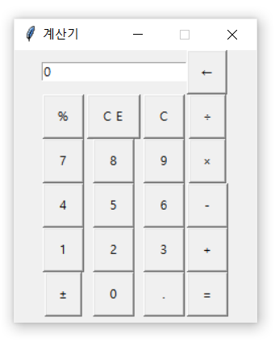

# Python GUI Calculator
Python GUI Calculator with Tkinter Package

## Setup Python Virtual Environments and Activate
```console
> cd your/project/path/python-gui-calculator
> python -m venv venv
> venv/Scripts/activate
```

## Setup and Build Application
```console
> python setup.py build
```

## Run Application
```console
> python main.py
```

## Example

